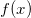
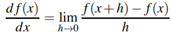

# Resuls and Analysis

##  Numerical Differentiation

The mathematical definition of the derivative of a function  is

  

## Tests

### Method 1

exp(x):

|x\h    |h = 0.1    |h = 1.0e-2 |h = 1.0e-3 |h = 1.0e-4 |h = 1.0e-5 |h = 1.0e-7     |h = 1.0e-9     |h = 1.0e-11 |Exact value  |
|---    |---        |---        |---        |---        |---        |---            |---            |---         |---          |
|**0.0**|1.051709181|1.005016708|1.000500167|1.000050002|1.000005   |1.000000049    |**1.000000083**|1.000000083 |1.0          |
|**1.0**|2.858841955|2.731918656|2.719641423|2.718417747|2.71829542 |**2.718281968**|2.718282044    |2.718314462 |2.7182818284 |
|**5.0**|156.087482 |149.1577046|148.4873904|148.42058  |148.4139012|148.413167     |**148.4131644**|148.4124823 |148.413159102|

sin(x):

|x\h    |h = 0.1    |h = 1.0e-2 |h = 1.0e-3 |h = 1.0e-4 |h = 1.0e-5 |h = 1.0e-7     |h = 1.0e-9     |h = 1.0e-11 |Exact value  |
|---    |---        |---        |---        |---        |---        |---            |---            |---         |---          |
|**0.0**|0.998334166|0.999983333|0.999999833|0.999999998|**1.0**    |1.0            |1.0            |1.0         |1.0          |
|**1.0**|0.497363753|0.536085981|0.539881480|0.540260231|0.540298099|**0.540302264**|0.540302358    |0.540301137 |0.54030230586|
|**5.0**|0.331095923|0.288452039|0.284141600|0.283710131|0.283666980|0.283662234    |**0.283662205**|0.283661983 |0.28366218546|

---

### Method 2

exp(x)

|x\h    |h = 0.1     |h = 1.0e-2  |h = 1.0e-3  |h = 1.0e-4  |h = 1.0e-5      |h = 1.0e-7  |h = 1.0e-9  |h = 1.0e-11 |Exact value  |
|---    |---         |---         |---         |---         |---             |---         |---         |---         |---          |
|**0.0**|1.0016675   |1.0000167   |1.0000002   |1.000000002 |**1.0**         |0.999999999 |1.000000027 |1.000000083 |1.0          |
|**1.0**|2.722814564 |2.718327133 |2.718282282 |2.718281833 |**2.718281829** |2.718281829 |2.718281822 |2.718292258 |2.7182818284 |
|**5.0**|148.66063807|148.41563267|148.41318384|148.41315935|**148.41315910**|148.41315959|148.41316442|148.41248230|148.413159102|

sin(x)

|x\h    |h = 0.1    |h = 1.0e-2 |h = 1.0e-3 |h = 1.0e-4     |h = 1.0e-5     |h = 1.0e-7     |h = 1.0e-9     |h = 1.0e-11 |Exact value  |
|---    |---        |---        |---        |---            |---            |---            |---            |---         |---          |
|**0.0**|0.998334166|0.999983333|0.999999833|0.999999998    |**1.0**        |1.0            |1.0            |1.0         |1.0          |
|**1.0**|0.539402252|0.540293301|0.540302216|0.540302305    |**0.540302306**|0.540302306    |0.540302303    |0.540301137 |0.54030230586|
|**5.0**|0.283189651|0.283657458|0.283662138|**0.283662185**|0.283662185    |0.283662186    |0.283662205    |0.283661983 |0.28366218546|