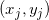
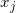
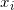

# Lagrange's Interpolation

## Lagrange polynomial

In numerical analysis, Lagrange polynomials are used for polynomial interpolation. For a given set of points  with no two  values equal, the Lagrange polynomial is the polynomial of lowest degree that assumes at each value  the corresponding value , so that the functions coincide at each point.

## Definition

Given a set of k + 1 data points

where no two  are the same, the <b>interpolation polynomial in the Lagrange form</b> is a linear combination

,

where . Note how, given the initial assumption that no two  are the same, , so this expression is always well-defined. The reason pairs  with  are not allowed is that no interpolation function {\displaystyle L}L such that {\displaystyle y_{i}=L(x_{i})}y_{i}=L(x_{i}) would exist; a function can only get one value for each argument . On the other hand, if also {\displaystyle y_{i}=y_{j}}y_{i}=y_{j}, then those two points would actually be one single point.

