# Lagrange's Interpolation

## Lagrange polynomial

In numerical analysis, Lagrange polynomials are used for polynomial interpolation. For a given set of points  with no two  values equal, the Lagrange polynomial is the polynomial of lowest degree that assumes at each value  the corresponding value , so that the functions coincide at each point.

## Definition

Given a set of k + 1 data points


where no two  are the same, the <b>interpolation polynomial in the Lagrange form</b> is a linear combination

,

of Lagrange basis polynomials


where . Note how, given the initial assumption that no two  are the same, , so this expression is always well-defined. The reason pairs  with  are not allowed is that no interpolation function 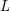 such that 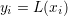 would exist; a function can only get one value for each argument . On the other hand, if also 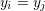, then those two points would actually be one single point.

For all 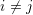, 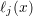 includes the term  in the numerator, so the whole product will be zero at 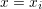:


On the other hand,


In other words, all basis polynomials are zero at , except 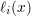, for which it holds that 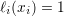, because it lacks the  term.

It follows that 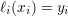, so at each point , 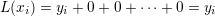, showing that  interpolates the function exactly.

## Algorithm

```cpp
double LP(double *X, double *Y, double x, int n) {
    double mult, result = 0;
  
    for (int i = 0; i < n; i++) {
        mult = Y[i];
        for (int j = 0; j < n; j++) {
            if (j != i)
                mult *= (x - X[j]) / (X[i] - X[j]);
        }
        result += mult;
    }
  
    return result; 
}
```


## Runge's example

<p align="center">
  
</p>

 The function 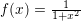 cannot be interpolated accurately on [−5, 5]
using a tenth-degree polynomial (dashed curve) with equally-spaced interpolation points. This
example that illustrates the difficulty that one can generally expect with high-degree polynomial
interpolation with equally-spaced points is known as <i>Runge’s example</i>.