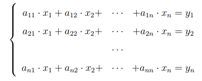

# Matrix Gauss Elimination Method

The Gauss method is a classical method for solving a system of linear algebraic equations (SLAE). Consider a system of linear equations with real constant coefficients

    

or in matrix form