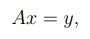
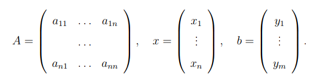
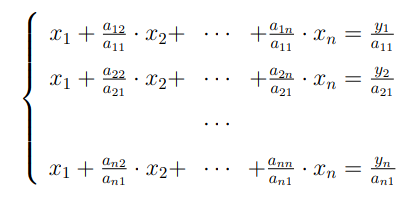
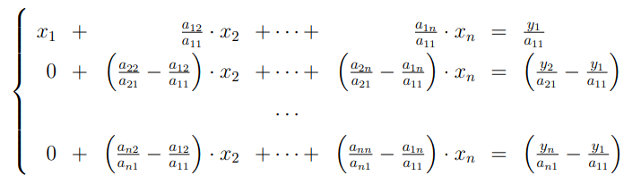
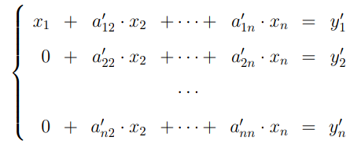
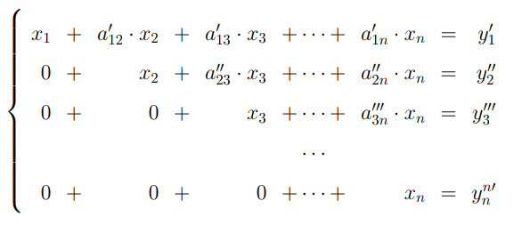
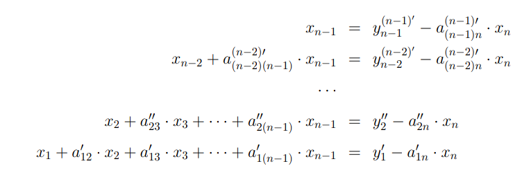
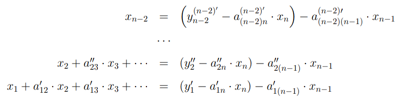

# Matrix Gauss Elimination Method

The Gauss method is a classical method for solving a system of linear algebraic equations (SLAE). Consider a system of linear equations with real constant coefficients

    

or in matrix form

    

where

    

The Gauss method of solving a system of linear equations includes 2 stages:

* sequential (direct) exception;

* reverse substitution.

## Sequential exception

Gauss exceptions are based on the idea of ​​successive exceptions variables one at a time until only one equation remains with one variable on the left side. Then this equation is solved with respect to a single variable. Thus, the system of equations lead to a triangular (step) shape. For this, among the elements the first column of the matrix is ​​selected nonzero (and most often maximum) element and move it to its highest position by rearranging lines. Then all the equations are normalized, dividing it by the coefficient , where  is the column number.

    

Then the first line obtained after the permutation is subtracted from the remaining lines:

    

Получают новую систему уравнений, в которой заменены соответствующие коэффициенты.

    

After the indicated transformations have been completed, the first row and the first column are mentally deleted and continue the specified process for all subsequent equations until an equation with one unknown:

    

## Reverse substitution

Reverse substitution involves the substitution of the value of  obtained in the previous step into the previous equations:

    

This procedure is repeated for all remaining solutions:

    

