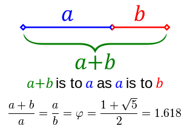

# Golden Ratio Method

## Introdution

The <b>golden-section search</b> is a technique for finding an <i>extremum</i> (minimum or maximum) of a function inside a specified interval. For a strictly unimodal function with an extremum inside the interval, it will find that extremum, while for an interval containing multiple extrema (possibly including the interval boundaries), it will converge to one of them. If the only extremum on the interval is on a boundary of the interval, it will converge to that boundary point. The method operates by successively narrowing the range of values on the specified interval, which makes it relatively slow, but very robust. 

<p align="center">
  
</p>

## Algorithm

```cpp
double golden_ratio_min(double a, double b, double (*f)(double)) {
    
    double x1, x2, fx1, fx2;
    
    x1 = b - (b - a) / phi; 
	x2 = a + (b - a) / phi;
    fx1 = f(x1);
    fx2 = f(x2);

    while (fabs(b - a) > eps) {
        if (fx1 >= fx2) {
            a = x1;
            x1 = x2;
            fx1 = fx2;
            x2 = a + (b - a) / phi;
            fx2 = f(x2);
        } else {
            b = x2;
            x2 = x1;
            fx2 = fx1;
            x1 = b - (b - a) / phi; 
            fx1 = f(x1);
        }
	}

    return (a + b) / 2.0;
}
```