# Newton’s Method

<b>Newton’s method</b> is one of the most popular numerical methods, and is even referred by <i>Burden</i> and <i>Faires</i> as the most powerful method that is used to solve for the equation . This method originates from the <i>Taylor’s series</i> expansion of the function  about the point 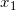:

<p align="center">
    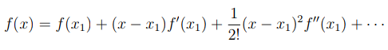
</p>

where , and its first and second order derivatives, 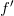 and 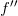 are calculated at . If we take the first two terms of the Taylor’s series expansion we have:

<p align="center">
    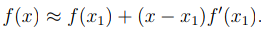
</p>

We then set <i>previous expression</i> to zero (i.e  ) to find the root of the equation which gives us:

<p align="center">
    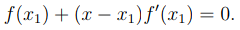
</p>

Rearranging the <i>previous expression</i> we obtain the next approximation to the root, giving us:

<p align="center">
    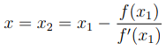
</p>

Thus generalizing <i>previous expression</i> we obtain Newton’s iterative method:

<p align="center">
    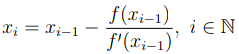
</p>

where 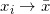 (as 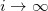), and 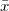 is the approximation to a root of the function .

<br />

<b><i>Remark:</i></b> As the iterations begin to have the same repeated values i.e. as 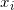 = 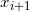 =  this is an indication that  converges to . Thus  is the root of the function .

## Steps of Newton’s method

### Step 1:

Let  be a given initial vector.

### Step 2:

Calculate 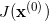 and 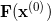.

### Step 3:

We now have to calculate the vector 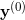, where

<p align="center">
    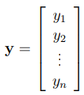
</p>

In order to find , we solve the linear system 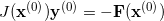, using Gaussian Elimination.

<b><i>Remark:</i></b> Rearranging the system in Step 3, we get that 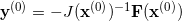. The significance of this is that, since , we can replace 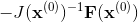 in our iterative formula with . This result will yield that

<p align="center">
    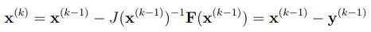
</p>

### Step 4:

Once  is found, we can now proceed to finish the first iteration by solving for 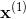 . Thus using the result from Step 3, we have that

<p align="center">
    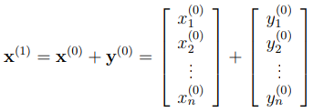
</p>

### Step 5:

Once we have calculated , we repeat the process again, until 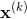 converges to . This indicates we have reached the solution to , where  is the solution to the system.

<br />

<b><i>Remark:</i></b> When a set of vectors converges, the norm 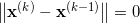. This means that

<p align="center">
    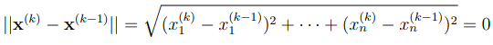
</p>

# Code representation of algorithm

```cpp
// NSE.cpp

// Newton's Method for Nonlinear Systems of Equations
void NSE(void (*f)(double *x, double *fv, int n), double *x,
             double *fv, int n, double eps, int *maxiter)
{
    double tmp, delta, **jac, *p, *x0;
    int i, j, k;

    jac = new double *[n];
    for (i = 0; i < n; i++)
        jac[i] = new double[n];

    p = new double[n];
    x0 = new double[n];

    for (k = 0; k < *maxiter; k++)
    {
        f(x, fv, n); // get residuals for current value of 'x'

        // Compute Jacobian matrix
        for (i = 0; i < n; i++)
        {
            tmp = x[i];
            delta = (tmp > 1.0) ? eps * tmp : eps;
            x[i] = tmp + delta; // bump this element
            delta = x[i] - tmp; // try this to reduce error (from Schnabel)
            f(x, p, n);
            x[i] = tmp; // restore original value

            for (j = 0; j < n; j++)
                jac[j][i] = (p[j] - fv[j]) / delta;
        }

        // Update residuals
        for (i = 0; i < n; i++)
        {
            tmp = 0.0;
            for (j = 0; j < n; j++)
            {
                tmp += jac[i][j] * x[j];
            }
            p[i] = tmp - fv[i];
        }

        // Update solution vector
        GEM(jac, p, x0, n); // Gauss Elimination Method

        // Test for convergence
        tmp = 0.0;
        for (i = 0; i < n; i++)
        {
            tmp += fabs(x[i] - x0[i]);
            x[i] = x0[i];
        }

        if (tmp < 1e-4)
            break;
    }

    *maxiter = k;

    // Delete temporary storage
    delete[] x0;
    delete[] p;

    for (i = 0; i < n; i++)
        delete[] jac[i];

    delete[] jac;
}

```

# Usage

Imagine that we want to integrate the following expression:

<p align="center">
    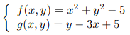
</p>

Then the code will look like this:

```cpp
// main.cpp

#include <math.h>
#include <iostream>
#include "NSE.cpp"
using namespace std;

#define N 2
#define eps 1e-7

// Function with Nonlinear Systems of Equations
void f(double *x, double *fv, int n) {
    fv[0] = x[0]*x[0] + x[1]*x[1] - 5;
    fv[1] = x[1] - 3*x[0] + 5;
}

int main() {
    // Variable initialization
    double *x = new double[N], *fv = new double[N];
    int maxiter = 100;

    // Initial point
    x[0] = 1; x[1] = 2;

    // Newton's Method for Nonlinear Systems of Equations
    NSE(f, x, fv, N, eps, &maxiter);

    // Results:
    cout << "X:\n";
    for (int i = 0; i < N; i++) cout << "x[" << i << "] = " << x[i] << endl;
    cout << "\nFv:\n";
    for (int i = 0; i < N; i++) cout << "Fv[" << i << "] = " << fv[i] << endl;
    cout << "\nNumber of iterations = " << maxiter << "\n";

    return 0;
}
```

Output will be:

```
X:
x[0] = 2
x[1] = 1

Fv:
Fv[0] = 5.96168e-07
Fv[1] = 3.24896e-12

Number of iterations = 4
```

# Tests

#### Problem:

<p align="center">
    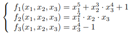
</p>

#### Code:

```cpp
// main.cpp

// ...

// Function with Nonlinear Systems of Equations
void f(double *x, double *fv, int n) {
    fv[0] = pow(x[0], 5) + pow(x[1], 3) * pow(x[2], 4) + 1;
    fv[1] = x[0]*x[0]*x[1]*x[2];
    fv[2] = pow(x[2], 4) - 1;
}

// ...
```

#### Output:

```
X:
x[0] = -0.0019944
x[1] = -1
x[2] = 1

Fv:
Fv[0] = -3.44946e-12
Fv[1] = -3.97763e-06
Fv[2] = 0

Number of iterations = 14
```

#### Solution from [WolframAlpha](https://www.wolframalpha.com/input/?i=solve+%28x%5E5+%2B+y%5E3+*+z%5E4+%2B+1%29%2C+%28x%5E2*y*z%29%2C+%28z%5E4+-+1%29):

<p align="center">
    
</p>

---

#### Problem:

<p align="center">
    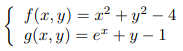
</p>

#### Code:

```cpp
// main.cpp

// ...

// Function with Nonlinear Systems of Equations
void f(double *x, double *fv, int n) {
    fv[0] = x[0]*x[0] + x[1]*x[1] - 4;
    fv[1] = exp(x[0]) + x[1] - 1;
}

// ...
```

#### Output:

```
X:
x[0] = -1.81626
x[1] = 0.837368

Fv:
Fv[0] = 5.90633e-05
Fv[1] = 3.92637e-06

Number of iterations = 5
```

#### Solution from [WolframAlpha](https://www.wolframalpha.com/input/?i=solve+x%5E2+%2B+y%5E2+%3D+4%2C+exp%28x%29+%2B+y+%3D+1):

<p align="center">
    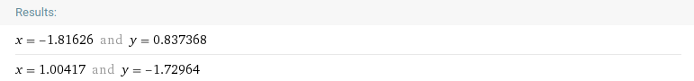
</p>
