# A Nonlinear Systems of Equations

<b><i>Definition:</i></b> A function  is defined as being <i>nonlinear</i> when it does not satisfy the <i>superposition principle</i> that is

    

Now that we know what the term nonlinear refers to we can define a <i>system of nonlinear equations</i>.

 

<b><i>Definition:</i></b> A <i>system of nonlinear equations</i> is a set of equations as the following:

    

where 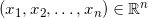 and each 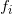 is a nonlinear real function, 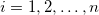.

 

<b><i>Definition:</i></b> A solution of a system of equations 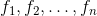 in n variables is a point 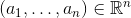 such that 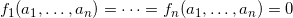.

 

Because systems of nonlinear equations can not be solved as nicely as linear systems,
we use procedures called iterative methods.

<b><i>Definition:</i></b> An <i>iterative method</i> is a procedure that is repeated over and over again, to find the root of an equation or find the solution of a system of equations.

<b><i>Definition:</i></b> Let <b>F</b> be a real function from 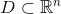 n to 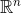. If <b>F</b>(<b>p</b>) = <b>p</b>, for some 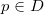, then p is said to be a fixed point of <b>F</b>.

# Convergence

One of the things we will discuss is the convergence of each of the numerical
methods.

<b><i>Definition:</i></b> We say that a sequence <i>converges</i> if it has a limit.

<b><i>Definition:</i></b> Let 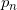 be a sequence that converges to 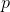, where pn 6= p. If constants
λ, α > 0 exist such that

    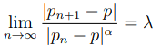

Then it is said that pn converges to p of order α with a constant λ.

 

There are three different orders of convergences.

<b><i>Definition:</i></b> A sequence  is said to be linearly convergent if  converges to  with order α = 1, for a constant λ < 1 such that

    

<b><i>Definition:</i></b> A sequence  is said to be quadratically convergent if  converges to  with order α = 2 such that

    

<b><i>Definition:</i></b> A sequence  is said to be superlinearly convergent if

    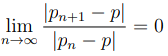

<b><i>Remark:</i></b> The value of α measures how fast a sequence converges. Thus the higher the value of α is, the more rapid the convergence of the sequence is. In the case of numerical methods, the sequence of approximate solutions is converging to the root. If the convergence of an iterative method is more rapid, then a solution may be reached in less interations in comparison to another method with a slower convergence.