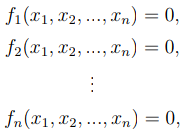

# A Nonlinear Systems of Equations

<b><i>Definition:</i></b> A function  is defined as being <i>nonlinear</i> when it does not satisfy the <i>superposition principle</i> that is

    

Now that we know what the term nonlinear refers to we can define a <i>system of nonlinear equations</i>.

 

<b><i>Definition:</i></b> A system of nonlinear equations is a set of equations as the following:

    

