# Dormand-Prince Method

The one step calculation in the Dormand-Prince method is done as the following.

<p align="center">
    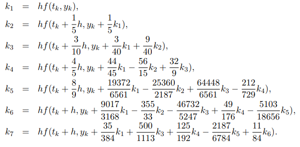
</p>

Then the next step value 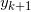 is calculated as

<p align="center">
    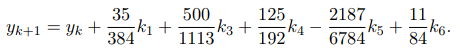
</p>

This is a calculation by Runge-Kutta method of order 4. We have to be aware that we do not use 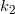, though it is used to calculate 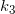 and so on.

Next, we will calculate the next step value 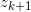 by Runge-Kutta method of order 5 as

<p align="center">
    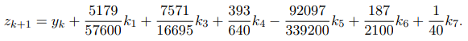
</p>

We calculate the difference of the two next values 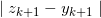.

<p align="center">
    
</p>

This is considered as the error in . We calculate the optimal time interval 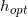 as,

<p align="center">
    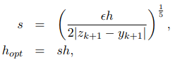
</p>

where  in the right side is the old time interval. In practical programming, this new  will be used in the next step of the calculation, though the author thinks it should be also used in the present calculation when it is very small, half or smaller for example.

## Code representation of algorithm

```cpp
// dorpi.c

int dorpi_4_5(double (*f)(double, double), double y[], double x, double h, double xmax, double *h_next, double tolerance ) {
    ////////////////////////////////////////////////////////////////////////////////
    // int dorpi_4_5( double (*f)(double, double),           //
    //       double y[], double x, double h, double xmax, double *h_next,         //
    //                                                        double tolerance )  //
    //                                                                            //
    //  Description:                                                              //
    //     This function solves the differential equation y'=f(x,y) with the      //
    //     initial condition y(x) = y[0].  The value at xmax is returned in y[1]. //
    //     The function returns 0 if successful or -1 if it fails.                //
    //                                                                            //
    //  Arguments:                                                                //
    //     double *f  Pointer to the function which returns the slope at (x,y) of //
    //                integral curve of the differential equation y' = f(x,y)     //
    //                which passes through the point (x0,y0) corresponding to the //
    //                initial condition y(x0) = y0.                               //
    //     double y[] On input y[0] is the initial value of y at x, on output     //
    //                y[1] is the solution at xmax.                               //
    //     double x   The initial value of x.                                     //
    //     double h   Initial step size.                                          //
    //     double xmax The endpoint of x.                                         //
    //     double *h_next   A pointer to the estimated step size for successive   //
    //                      calls to Runge_Kutta_Prince_Dormand_v2_4_5.           //
    //     double tolerance The tolerance of y(xmax), i.e. a solution is sought   //
    //                so that the relative error < tolerance.                     //
    //                                                                            //
    //  Return Values:                                                            //
    //     0   The solution of y' = f(x,y) from x to xmax is stored y[1] and      //
    //         h_next has the value to the next size to try.                      //
    //    -1   The solution of y' = f(x,y) from x to xmax failed.                 //
    //    -2   Failed because either xmax < x or the step size h <= 0.            //
    //                                                                            //
    ////////////////////////////////////////////////////////////////////////////////
    double scale, err, yy, temp_y[2], k1, k2, k3, k4, k5, k6, k7, h5;
    const double    r_45        = 1.0 / 45.0,
                    r_8_9       = 8.0 / 9.0,
                    r_6561      = 1.0 / 6561.0,
                    r_167904    = 1.0 / 167904.0,
                    r_142464    = 1.0 / 142464.0,
                    r_21369600  = 1.0 / 21369600.0;

    int i, last_interval = 0;

        // Verify that the step size is positive and that the upper endpoint //
        // of integration is greater than the initial enpoint.               //

    if (xmax < x || h <= 0.0) return -2;

        // If the upper endpoint of the independent variable agrees with the //
        // initial value of the independent variable.  Set the value of the  //
        // dependent variable and return success.                            //

    *h_next = h;
    y[1] = y[0];
    if (xmax == x) return 0;

        // Insure that the step size h is not larger than the length of the //
        // integration interval.                                            //

    h = min(h, xmax - x);

        // Redefine the error tolerance to an error tolerance per unit    //
        // length of the integration interval.                            //

    tolerance /= (xmax - x);

        // Integrate the diff eq y'=f(x,y) from x=x to x=xmax trying to  //
        // maintain an error less than tolerance * (xmax-x) using an     //
        // initial step size of h and initial value: y = y[0]            //

    temp_y[0] = y[0];
    while ( x < xmax ) {
        scale = 1.0;
        for (i = 0; i < ATTEMPTS; i++) {
                //              Runge-Kutta Method               //
            h5 = 0.2 * h;
            k1 = (*f)(x, *temp_y);
            k2 = (*f)(x+h5, *temp_y + h5 * k1);
            k3 = (*f)(x+0.3*h, *temp_y + h * (0.075 * k1 + 0.225 * k2) );
            k4 = (*f)(x+0.8*h, *temp_y + r_45 * h * (44.0 * k1 - 168.0 * k2 + 160.0 * k3) );
            k5 = (*f)(x+r_8_9 * h,  *temp_y + r_6561 * h * (19372.0 * k1 - 76080.0 * k2 + 64448.0 * k3 - 1908.0 * k4) );
            k6 = (*f)(x+h, *temp_y + r_167904 * h * (477901.0 * k1 - 1806240.0 * k2 + 1495424.0 * k3 + 46746.0 * k4 - 45927.0 * k5) );
            k7 = (*f)(x+h, *temp_y + r_142464 * h * (12985.0 * k1 + 64000.0 * k3 + 92750.0 * k4 - 45927.0 * k5 + 18656.0 * k6) );
            *(temp_y+1) = *temp_y +  r_21369600 * h * (1921409.0 * k1 + 9690880.0 * k3 + 13122270.0 * k4 - 5802111.0 * k5 + 1902912.0 * k6 + 534240.0 * k7);
            err = fabs(r_21369600 * (26341.0 * k1 - 90880.0 * k3 + 790230.0 * k4 - 1086939.0 * k5 + 895488.0 * k6 - 534240.0 * k7) );

            if (err < eps) { scale = MAX_SCALE_FACTOR; break; }
            yy = (fabs(temp_y[0]) < eps) ? tolerance : fabs(temp_y[0]);
            scale = 0.8 * sqrt( sqrt ( tolerance * yy /  err ) );
            scale = min( max(scale,MIN_SCALE_FACTOR), MAX_SCALE_FACTOR);
            if (err < (tolerance * yy)) break;
            h *= scale;
            if (x + h > xmax) h = xmax - x;
            else if (x + h + 0.5 * h > xmax) h = 0.5 * h;
        }
        if ( i >= ATTEMPTS ) { *h_next = h * scale; return -1; };
        temp_y[0] = temp_y[1];
        x += h;
        h *= scale;
        *h_next = h;
        if ( last_interval ) break;
        if (  x + h > xmax ) { last_interval = 1; h = xmax - x; }
        else if ( x + h + 0.5 * h > xmax ) h = 0.5 * h;
    }
    y[1] = temp_y[1];
    return 0;
}
```

# Usage

Imagine that we want to integrate the following expression:

<p align="center">
    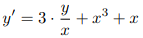
</p>

Then the code will look like this:

```cpp
// main.c

#include <stdio.h>
#include <math.h>
#include "dorpi.c"

// Function (ordinary differential equation)
double fxy(double x, double y) {
    return 3.0*y/x + x*x*x + x;
}

int main(void) {
    // Variable initialization
    double y[2], x0, x1, h, h_next;

    // Initial point
    x0 = 1; y[0] = 3;

    // Point where we want calculate y(x1)
    x1 = 2.0;

    // Step size
    h = 0.01;

    // Dormand-Prince Method
    dorpi_4_5(fxy, y, x0, h, x1, &h_next, 1e-5);

    printf("Result = %lf\n", y[1]);

    return 0;
}
```

Output will be:

```
Result = 36.000068
```

# Tests

#### Problem

<p align="center">
    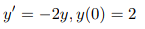
</p>

#### Code:

```cpp
// main.c

// ...

// Function (ordinary differential equation)
double fxy(double x, double y) {
    return (-1)*(2*y);
}

int main(void) {
    // ...

    // Initial point
    x0 = 1; y[0] = 3;

    // Point where we want calculate y(x1)
    x1 = 2.0;

    // ...
}
```

#### Output

```
Result = 0.036631
```

#### Solution from [WolframAlpha](https://www.wolframalpha.com/input/?i=dy%2Fdx+%3D+-2y%2C+y%280%29+%3D+2)

<p align="center">
    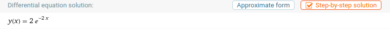
</p>

# References

- ["ExplicitRungeKutta" Method for NDSolve](http://reference.wolfram.com/mathematica/tutorial/NDSolveExplicitRungeKutta.html)

- [Dormand–Prince method - Wikipedia](https://en.wikipedia.org/wiki/Dormand%E2%80%93Prince_method)
