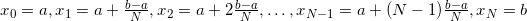
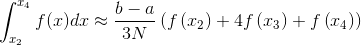
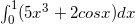

# Ti_Integral
Integral Approximation - Simpson's Rule


---
## Definition

Suppose  is defined on the interval . Then Simpson's rule on the entire interval approximates the definite integral of  on the interval by the formula

<p align="center">
  
</p>

The idea is that if , , , this formula is an exact equality. So Simpson's rule gives the correct integral of any quadratic function. In general, Simpson's rule approximates  by a parabola through the points on the graph of  with -coordinates , , .

Simpson's rule is usually applied by breaking the interval into  equal-sized subintervals, where  is an even number, and approximating the integral over each pair of adjacent subintervals using the above estimate.

That is, let . Then

<p align="center">
  
</p>

<p align="center">
  
</p>

and so on. Adding these up gives

<p align="center">
  .
</p>

---
## How to use
```cpp
// Integrates function {f} from {lower_bound} to {higher_bound}
double *I = Ti_Integrate(f, lower_bound, higher_bound);
```

Function returns an array, where first number is value of integral, and the second is accuracy:
```cpp
printf("The integral is equal to %lg", I[0]); // ans
printf("Accuracy of calculation is %lg", I[1]); // error
```

You can write your own function to integrate from code
```cpp
double f(double x) {
    return sin(x); // You can write your own function to integrate here
}
```

You can also change lower or higher bound of integration
```cpp
double from = 0; // Lower bound of integral
double to = 3.1415926535897932384626; // Higher bound of integral
```

At the top of code you can edit an eps (accuracy of calculation)
```cpp
#define eps 1e-9 // The accuracy we want to get
```

---
## Example
Imagine that we want to integrate the following expression:

<p align="center">
  .
</p>

Then the code will look like this:
```cpp
// ...

/* The main function */
int main(void) {

    double *I = Ti_Integrate(f, 0, 1);

    printf("ans = %lg\nerr = %lg\n", I[0], I[1]);

    return 0;
}

/* Function to be integrated */
double f(double x) {
    return 5*pow(x, 3) + 2*cos(x);
}

// ...
```

Output will be:
```
ans = 2.93294
err = 6.07469e-09
```