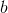

# Ti_Integral
Integral Approximation - Simpson's Rule

### Definition
---

Suppose  is defined on the interval . Then Simpson's rule on the entire interval approximates the definite integral of  on the interval by the formula

  

The idea is that if , , , this formula is an exact equality. So Simpson's rule gives the correct integral of any quadratic function. In general, Simpson's rule approximates  by a parabola through the points on the graph of  with -coordinates , , .