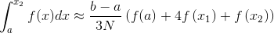
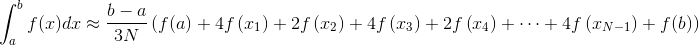

# Ti_Integral
Integral Approximation - Simpson's Rule

# Definition

Suppose  is defined on the interval . Then Simpson's rule on the entire interval approximates the definite integral of  on the interval by the formula

  

The idea is that if , , , this formula is an exact equality. So Simpson's rule gives the correct integral of any quadratic function. In general, Simpson's rule approximates  by a parabola through the points on the graph of  with -coordinates , , .

Simpson's rule is usually applied by breaking the interval into  equal-sized subintervals, where  is an even number, and approximating the integral over each pair of adjacent subintervals using the above estimate.

That is, let . Then

  

  

and so on. Adding these up gives

  

