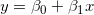
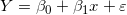
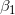
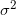
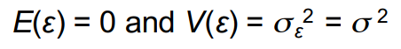

# Linear Regression

## Introdution
In statistics, linear regression is a linear approach to modeling the relationship between a scalar response (or dependent variable) and one or more explanatory variables (or independent variables). The case of one explanatory variable is called simple linear regression. For more than one explanatory variable, the process is called multiple linear regression. This term is distinct from multivariate linear regression, where multiple correlated dependent variables are predicted, rather than a single scalar variable.

## The Simple Linear Regression Model

The simplest deterministic mathematical relationship between
two variables x and y is a linear relationship: .

The objective of this section is to develop an equivalent <i>linear
probabilistic model</i>.

If the two (random) variables are <i>probabilistically related</i>, then for
a fixed value of x, there is <i>uncertainty</i> in the value of the second
variable.

So we assume , where ε is a random variable.

Two variables are related linearly “on average” if for fixed x the actual value of Y differs from its expected value by a random amount (i.e. there is random error).

## A Linear Probabilistic Model

<b>Definition:</b> <i>(The Simple Linear Regression Model)</i>

There are parameters , , and , such that for any fixed value of the independent variable x, the dependent variable is a random variable related to x through the model equation

  

The quantity ε in the model equation is the “error” - a random variable, assumed to be symmetrically distributed with 

  

<i>(no assumption made about the distribution of ε, yet)</i>