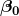
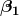
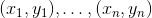
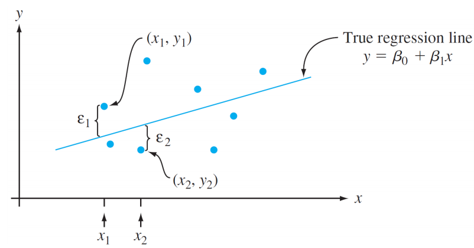
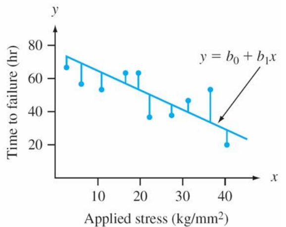

# Linear Regression

## Introdution
In statistics, linear regression is a linear approach to modeling the relationship between a scalar response (or dependent variable) and one or more explanatory variables (or independent variables). The case of one explanatory variable is called simple linear regression. For more than one explanatory variable, the process is called multiple linear regression. This term is distinct from multivariate linear regression, where multiple correlated dependent variables are predicted, rather than a single scalar variable.

## The Simple Linear Regression Model

The simplest deterministic mathematical relationship between
two variables x and y is a linear relationship: .

The objective of this section is to develop an equivalent <i>linear
probabilistic model</i>.

If the two (random) variables are <i>probabilistically related</i>, then for
a fixed value of x, there is <i>uncertainty</i> in the value of the second
variable.

So we assume , where ε is a random variable.

Two variables are related linearly “on average” if for fixed x the actual value of Y differs from its expected value by a random amount (i.e. there is random error).

## A Linear Probabilistic Model

<b>Definition:</b> <i>(The Simple Linear Regression Model)</i>

There are parameters , , and , such that for any fixed value of the independent variable x, the dependent variable is a random variable related to x through the model equation

  

The quantity ε in the model equation is the “error” - a random variable, assumed to be symmetrically distributed with 

  

<i>(no assumption made about the distribution of ε, yet)</i>

* <b>X</b>: the independent, predictor, or explanatory variable <i>(usually known)</i>.
* <b>Y</b>: The dependent or response variable. For fixed x, Y will be random variable.
* <b>ε</b>: The random deviation or random error term. For fixed x, ε will be random variable.
* : The average value of Y when x is zero <i>(the intercept of the true regression line)</i>
* : The expected (average) change in Y associated with a 1-unit increase in the value of x. <i>(the slope of the true regression line)</i>

The points  resulting from n independent
observations will then be scattered about the true
regression line:

  

## Estimating Model Parameters

The values of , , and  will almost <i>never be known</i> to an investigator. 

Instead, sample data consists of n observed pairs  from which the model parameters and the true regression line itself can be <i>estimated</i>. 

The data (pairs) are assumed to have been obtained independently of one another.

The “best fit” line is motivated by the principle of <b>least squares</b>, which can be traced back to the German mathematician <b>Gauss</b> (1777–1855):

A line provides the best fit to the data if the sum of the squared vertical distances (deviations) from the observed points to that line is as small as it can be.

  

