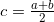

# Bisection Method

## Bisection method

In mathematics, the <b>bisection method</b> is a root-finding method that applies to any continuous functions for which one knows two values with opposite signs. The method consists of repeatedly bisecting the interval defined by these values and then selecting the subinterval in which the function changes sign, and therefore must contain a root. It is a very simple and robust method, but it is also relatively slow. Because of this, it is often used to obtain a rough approximation to a solution which is then used as a starting point for more rapidly converging methods. The method is also called the <b>interval halving method</b>, the <b>binary search method</b>, or the <b>dichotomy method</b>.

<p align="center">
  
</p>


## The method

The method is applicable for numerically solving the equation f(x) = 0 for the real variable x, where f is a continuous function defined on an interval [a, b] and where f(a) and f(b) have opposite signs. In this case a and b are said to bracket a root since, by the intermediate value theorem, the continuous function f must have at least one root in the interval (a, b).

At each step the method divides the interval in two by computing the midpoint  of the interval and the value of the function f(c) at that point. Unless c is itself a root (which is very unlikely, but possible) there are now only two possibilities: either f(a) and f(c) have opposite signs and bracket a root, or f(c) and f(b) have opposite signs and bracket a root. The method selects the subinterval that is guaranteed to be a bracket as the new interval to be used in the next step. In this way an interval that contains a zero of f is reduced in width by 50% at each step. The process is continued until the interval is sufficiently small.

Explicitly, if f(a) and f(c) have opposite signs, then the method sets c as the new value for b, and if f(b) and f(c) have opposite signs then the method sets c as the new a. (If f(c)=0 then c may be taken as the solution and the process stops.) In both cases, the new f(a) and f(b) have opposite signs, so the method is applicable to this smaller interval.


<dt><b>Iteration tasks</b></dt>

1. Calculate c, the midpoint of the interval, .
2. Calculate the function value at the midpoint, f(c).
3. If convergence is satisfactory (that is, c - a is sufficiently small, or |f(c)| is sufficiently small), return c and stop iterating.
4. Examine the sign of f(c) and replace either (a, f(a)) or (b, f(b)) with (c, f(c)) so that there is a zero crossing within the new interval.


## Algorithm

```cpp
double bisection_method(double a, double b, double (*f)(double), double *root_x) {
	double fa, fb, sgn_fa, sgn_fb, x, fx, sgn_fx;

	fa = f(a);
	fb = f(b);

	sgn_fa = sgn(fa);
	sgn_fb = sgn(fb);
	
	if (sgn_fa == 0) { 
		*root_x = a;
		return 1;
	} else if (sgn_fb == 0) {
		*root_x = b;
		return 1;
	} else if (sgn_fa == sgn_fb) {
		return 0;
	}

	while ((fabs(b - a) > eps) && (fabs(b - a) > eps*fabs(a))) {
		x = (a + b)/2;
		fx = f(x);
		sgn_fx = sgn(fx);

		if (sgn_fa == sgn_fx) {
			a = x;
		} else if (sgn_fb == sgn_fx) {
			b = x;
		} else {
			break;
		}
	}
	
	*root_x = x;

	return 1;
}
```