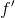
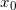
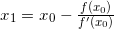
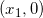
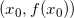
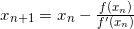
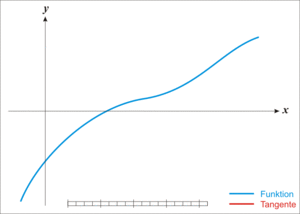

# Newton Method

## Method

In numerical analysis, <b>Newton's method</b>, also known as the <b>Newton–Raphson method</b>, named after <i>Isaac Newton</i> and <i>Joseph Raphson</i>, is a root-finding algorithm which produces successively better approximations to the roots (or zeroes) of a real-valued function. The most basic version starts with a single-variable function  defined for a real variable x, the function's derivative , and an initial guess  for a root of . If the function satisfies sufficient assumptions and the initial guess is close, then  is a better approximation of the root than . Geometrically,  is the intersection of the x-axis and the tangent of the graph of  at : that is, the improved guess is the unique root of the linear approximation at the initial point. The process is repeated as  until a sufficiently precise value is reached. This algorithm is first in the class of <i>Householder's methods</i>, succeeded by <i>Halley's method</i>. The method can also be extended to complex functions and to systems of equations.

  

