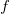
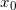
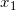
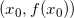
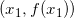
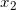
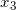
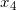
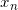
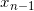

# Secant Method

## Secant Method

In numerical analysis, the <b>secant method</b> is a root-finding algorithm that uses a succession of roots of secant lines to better approximate a root of a function . The secant method can be thought of as a finite-difference approximation of Newton's method. However, the method was developed independently of Newton's method and predates it by over 3000 years.

  

## The method

The secant method is defined by the recurrence relation

As can be seen from the recurrence relation, the secant method requires two initial values,  and , which should ideally be chosen to lie close to the root.

## Derivation of the method

Starting with initial values  and , we construct a line through the points  and , as shown in the picture above. In slope–intercept form, the equation of this line is

The root of this linear function, that is the value of x such that y = 0 is

We then use this new value of x as  and repeat the process, using  and  instead of  and . We continue this process, solving for , , etc., until we reach a sufficiently high level of precision (a sufficiently small difference between  and ):

