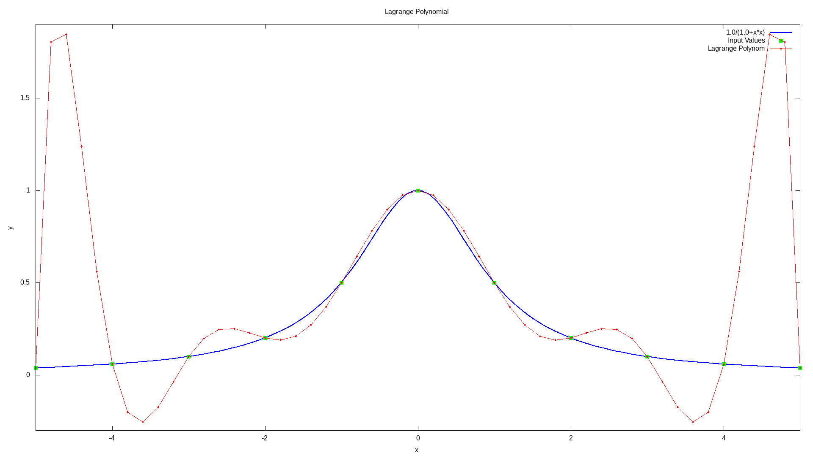

Lagrange's Interpolation
========================

Lagrange polynomial
-------------------

In numerical analysis, Lagrange polynomials are used for polynomial interpolation. For a given set of points :math:`(x_j, y_j)` with no two :math:`x_j` values equal, the Lagrange polynomial is the polynomial of lowest degree that assumes at each value :math:`x_j` the corresponding value :math:`x_j`, so that the functions coincide at each point.

Definition
----------

Given a set of :math:`k+1` data points :math:`(x_0, y_0),\dots,(x_j, y_j),\dots,(x_k, y_k)` where no two :math:`x_j` are the same, the **interpolation polynomial in the Lagrange form** is a linear combination :math:`L(x):=\sum_{j=0}^{k} y_{j} \ell_{j}(x)`, of Lagrange basis polynomials

.. math::
    :nowrap:

    \begin{equation}
        \ell_{j}(x):=\prod_{0 \leq m \leq k \atop m \neq j} \frac{x-x_{m}}{x_{j}-x_{m}}=\frac{\left(x-x_{0}\right)}{\left(x_{j}-x_{0}\right)} \cdots \frac{\left(x-x_{j-1}\right)}{\left(x_{j}-x_{j-1}\right)} \frac{\left(x-x_{j+1}\right)}{\left(x_{j}-x_{j+1}\right)} \cdots \frac{\left(x-x_{k}\right)}{\left(x_{j}-x_{k}\right)}
    \end{equation}

where :math:`0 \leq j \leq k`. Note how, given the initial assumption that no two :math:`x_j` are the same, :math:`x_j - x_m \neq 0`, so this expression is always well-defined. The reason pairs :math:`x_i = x_j` with :math:`y_i \neq y_j` are not allowed is that no interpolation function :math:`L` such that :math:`y_i=L(x_i)` would exist; a function can only get one value for each argumetn :math:`x_i`. On the other hand, if also :math:`y_i = y_j`, then those two points would actually be one single point.

For all :math:`i \neq j`, :math:`\ell(x)` includes the term :math:`(x-x_i)` in the numerator, so the whole pruduct will be zero at :math:`x = x_i`:

.. math::
    :nowrap:

    \begin{equation}
        \ell_{j \neq i}\left(x_{i}\right)=\prod_{m \neq j} \frac{x_{i}-x_{m}}{x_{j}-x_{m}}=\frac{\left(x_{i}-x_{0}\right)}{\left(x_{j}-x_{0}\right)} \cdots \frac{\left(x_{i}-x_{i}\right)}{\left(x_{j}-x_{i}\right)} \cdots \frac{\left(x_{i}-x_{k}\right)}{\left(x_{j}-x_{k}\right)}=0
    \end{equation}

On the other hand,

.. math::
    :nowrap:

    \begin{equation}
        \ell_{i}\left(x_{i}\right):=\prod_{m \neq i} \frac{x_{i}-x_{m}}{x_{i}-x_{m}}=1
    \end{equation}

In other words, all basis polynomials are zero at :math:`x = x_i`, except :math:`\ell_i(x)`, for which it holds that :math:`\ell_i(x_i) = 1`, because it lacks the :math:`(x - x_i)` term.

It follows that :math:`\ell_i(x_i) = y_i`, so at each point :math:`x_i`, :math:`L(x_i) = y_i + 0 + 0 + \dots + 0 = y_i`, showing that :math:`L` interpolates the function exactly.

Runge's example
---------------

The function :math:`f(x) = \frac{1}{1+x^2}` cannot be interpolated accurately on :math:`[−5, 5]` using a tenth-degree polynomial (dashed curve) with equally-spaced interpolation points. This example that illustrates the difficulty that one can generally expect with high-degree polynomial interpolation with equally-spaced points is known as *Runge’s example*.

Usage
-----

Imagine that we have following points and we want to build a Lagrange polynomial with this points:

+-----+------+
|  X  |   Y  | 
+=====+======+
|2.0  | 10.0 |
+-----+------+
|3.0  | 15.0 |
+-----+------+
|5.0  | 25.0 |
+-----+------+
|8.0  | 40.0 | 
+-----+------+
|12.0 | 60.0 |
+-----+------+

Then the code will look like this:

.. code-block:: cpp

    // example_lagrange_polynomial.cpp

    #include <iostream>
    #include "../src/numerary.hpp" // Numerary library

    using namespace std;
    using namespace numerary;

    /* The main function */
    int main() {

        const int N = 5;
        double *X = new double[N], *Y = new double[N];
        double y, x;

        // Points to interpolate
        X[0] = 2.0; Y[0] = 10.0;
        X[1] = 3.0; Y[1] = 15.0;
        X[2] = 5.0; Y[2] = 25.0;
        X[3] = 8.0; Y[3] = 40.0;
        X[4] = 12.0; Y[4] = 60.0;
        
        // Point where we want to get value of Lagrange Polynomial
        x = 7.0;

        y = Numerary::lagrange_polynomial(X, Y, x, N);

        cout << "y(" << x << ") = " << y << endl;

        delete[] X;
        delete[] Y;
        
        return 0;
    }
