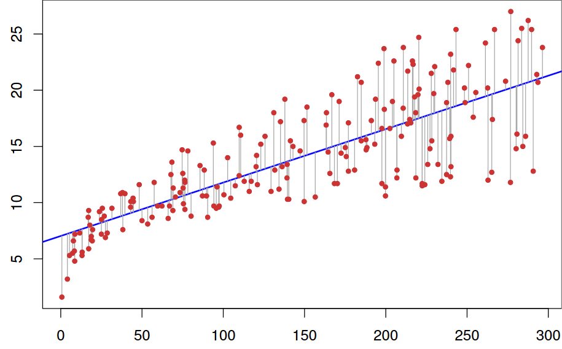

Linear Regression
=================

Introduction
------------

In statistics, linear regression is a linear approach to modeling the relationship between a scalar response (or dependent variable) and one or more explanatory variables (or independent variables). The case of one explanatory variable is called simple linear regression. For more than one explanatory variable, the process is called multiple linear regression. This term is distinct from multivariate linear regression, where multiple correlated dependent variables are predicted, rather than a single scalar variable.

The Simple Linear Regression Model
----------------------------------

The simplest deterministic mathematical relationship between two variables :math:`x` and :math:`y` is a linear relationship: :math:`y = \beta_0 + \beta_1 x`.

The objective of this section is to develop an equivalent *linear probabilistic model*.

If the two (random) variables are probabilistically related, then for a fixed value of x, there is uncertainty in the value of the second variable.

So we assume :math:`Y = \beta_0 + \beta_1 x + \varepsilon`, where :math:`\varepsilon` is a random variable.

Two variables are related linearly “on average” if for fixed x the actual value of Y differs from its expected value by a random amount (i.e. there is random error).

A Linear Probabilistic Model
----------------------------

**Definition:** (The Simple Linear Regression Model)

There are parameters :math:`\beta_0`, :math:`\beta_1`, and :math:`\sigma^2`, such that for any fixed value of the independent variable :math:`x`, the dependent variable is a random variable related to :math:`x` through the model equation

.. image:: ../img/linear-regression-2.png
    :align: center
    :scale: 25%
    :alt: Model equation

The quantity :math:`\varepsilon` in the model equation is the “error” - a random variable, assumed to be symmetrically distributed with

.. math::
    :nowrap:

    \begin{equation}
        E(\varepsilon)=0 \text { and } V(\varepsilon)=\sigma_{\varepsilon}^{2}=\sigma^{2}
    \end{equation}

(no assumption made about the distribution of :math:`\varepsilon`, yet)

- :math:`\boldsymbol{X}`: the independent, predictor, or explanatory variable (usually known).
- :math:`\boldsymbol{Y}`: the dependent or response variable. For fixed :math:`x`, :math:`Y` will be random variable.
- :math:`\boldsymbol{\varepsilon}`: the random deviation or random error term. For fixed :math:`x`, :math:`\varepsilon` will be random variable.
- :math:`\boldsymbol{\beta_0}`: the average value of :math:`Y` when :math:`x` is zero (the intercept of the true regression line)
- :math:`\boldsymbol{\beta_1}`: the expected (average) change in :math:`Y` associated with a 1-unit increase in the value of :math:`x`. (the slope of the true regression line)

The points :math:`(x_1, y_1),\dots,(x_n, y_n)` resulting from :math:`n` independent observations will then be scattered about the true regression line:

.. image:: ../img/linear-regression-3.png
    :align: center
    :scale: 55%
    :alt: True Regression Line

Estimating Model Parameters
---------------------------

The values of :math:`\beta_0`, :math:`beta_1`, and :math:`sigma` will almost never be known to an investigator.

Instead, sample data consists of n observed pairs :math:`(x_1, y_1),\dots,(x_n, y_n)` from which the model parameters and the true regression line itself can be estimated.

The data (pairs) are assumed to have been obtained independently of one another.

The “best fit” line is motivated by the principle of **least squares**, which can be traced back to the German mathematician **Gauss** (1777–1855):

A line provides the best fit to the data if the sum of the squared vertical distances (deviations) from the observed points to that line is as small as it can be.

.. image:: ../img/linear-regression-4.png
    :align: center
    :scale: 55%
    :alt: Squared Vertical Distances

The sum of *squared vertical deviations* from the points :math:`(x_1, y_1),\dots,(x_n, y_n)`

.. math::
    :nowrap:

    \begin{equation}
        f\left(b_{0}, b_{1}\right)=\sum_{i=1}^{n}\left[y_{i}-\left(b_{0}+b_{1} x_{i}\right)\right]^{2}
    \end{equation}

The point estimates of :math:`\beta_0` and :math:`\beta_1`, denoted by and, are called the least squares estimates – they are those values that minimize :math:`f(b_0, b_1)`.

The fitted **regression line** or **least squares** line is then the line whose equation is :math:`y=\hat{\beta}_{0}+\hat{\beta}_{1} x`.

The minimizing values of :math:`b_0` and :math:`b_1` are found by taking partial derivatives of :math:`f(b_0, b_1)` with respect to both :math:`b_0` and :math:`b_1`, equating them both to zero [analogously to :math:`f'(b)=0` in univariate calculus], and solving the equations

.. math::
    :nowrap:

    \begin{equation}
        \begin{array}{l}
            \frac{\partial f\left(b_{0}, b_{1}\right)}{\partial b_{0}}=\sum 2\left(y_{i}-b_{0}-b_{1} x_{i}\right)(-1)=0 \\

            \frac{\partial f\left(b_{0}, b_{1}\right)}{\partial b_{1}}=\sum 2\left(y_{i}-b_{0}-b_{1} x_{i}\right)\left(-x_{i}\right)=0
        \end{array}
    \end{equation}

The least squares estimate of the slope coefficient :math:`\beta_1` of the true regression line is

.. math::
    :nowrap:

    \begin{equation}
        b_{1}=\hat{\beta}_{1}=\frac{\sum\left(x_{i}-\bar{x}\right)\left(y_{i}-\bar{y}\right)}{\sum\left(x_{i}-\bar{x}\right)^{2}}=\frac{S_{x y}}{S_{x x}}
    \end{equation}

*Shortcut formulas* for the numerator and denominator of :math:`\hat{\beta_1}` are

.. math::
    :nowrap:

    \begin{equation}
        S_{x y}=\sum{x_{i} y_{i}}-\frac{\left(\sum{x_{i}}\right)\left(\sum{y_{i}}\right)}{n} \quad \text { and } \quad S_{x x}=\sum{x_{i}^{2}}-\frac{\left(\sum{x_{i}}\right)^2}{n}
    \end{equation}

The least squares estimate of the intercept :math:`b_0` of the true regression line is

.. math::
    :nowrap:

    \begin{equation}
        b_{0}=\hat{\beta}_{0}=\frac{\sum y_{i}-\hat{\beta}_{1} \sum x_{i}}{n}=\bar{y}-\hat{\beta}_{1} \bar{x}
    \end{equation}

Usage
-----

Imagine that we have following points and we want to build a linear regression model:

+-----+------+
|  X  |   Y  | 
+=====+======+
|1.0  | 1.0  |
+-----+------+
|2.0  | 2.0  |
+-----+------+
|3.0  | 1.3  |
+-----+------+
|4.0  | 3.75 | 
+-----+------+
|5.0  | 2.25 |
+-----+------+

Then the code will look like this:

.. code-block:: cpp

    
    // example_linear_regression.cpp

    #include <iostream>
    #include "../src/numerary.hpp" // Numerary library

    using namespace std;
    using namespace numerary;

    /* The main function */
    int main() {

        const int N = 5; // Number of points
        double *X = new double[N], *Y = new double[N], *predicted_kc = new double[2];

        X[0] = 1.0; Y[0] = 1.0;
        X[1] = 2.0; Y[1] = 2.0;
        X[2] = 3.0; Y[2] = 1.3;
        X[3] = 4.0; Y[3] = 3.75;
        X[4] = 5.0; Y[4] = 2.25;

        
        // Get predicted linear regression line
        predicted_kc = Numerary::linear_regression(X, Y, N);

        // Equation of regression line
        cout << "y = " << predicted_kc[0] << "*x + " << predicted_kc[1] << endl;

        // Reallocate memory
        delete[] X;
        delete[] Y;
        delete[] predicted_kc;
        
        return 0;
    }
